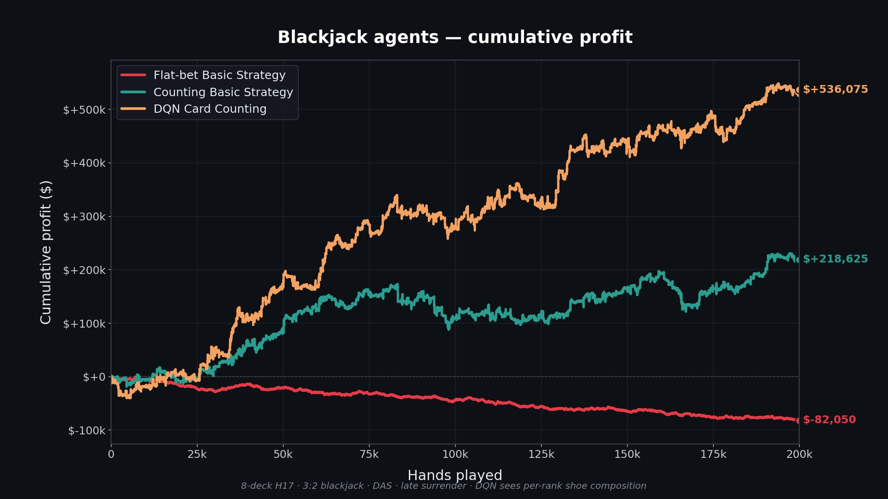

# Blackjack Q-Learning RL

A deep reinforcement learning agent that beats a textbook Hi-Lo card counter at blackjack — by **+1.3 percentage points of edge** — because it sees the *exact* shoe composition, not just the running count.

Three agents play 200,000 hands of high-limit-table blackjack head-to-head:

| Agent | Strategy | Edge | Net @ $50 unit |
|---|---|---:|---:|
| 1. Flat-bet Basic Strategy | Hardcoded basic strategy, flat $50 bet | **−0.82%** | **−$82,050** |
| 2. Counting Basic Strategy | Basic + Hi-Lo true count + Illustrious-18/Fab-4 + bet ramp 1–50 | **+2.19%** | **+$218,625** |
| 3. **DQN Card Counting** | Same bet ramp as Agent 2, **Dueling QR-DQN** decides plays from per-rank shoe composition | **+5.36%** | **+$536,075** |

*200,000 hands per agent, single shared seed — the same run shown in the video below.*

## Watch it play

<p align="center">
  <video src="https://github.com/lukegeel101/BlackJack-Q-Learning-RL/raw/main/blackjack_results.mp4" controls autoplay muted loop width="100%"></video>
</p>

<p align="center">
  <a href="blackjack_results.mp4"></a>
</p>

200,000 hands per agent, 8-deck H17 game, 3:2 blackjack, $50 base bet ramping up to $2,500 at high true counts. The flat-bet player bleeds slowly to the house edge. The counter pulls ahead at moderate counts. The neural net pulls ahead **more**, because it sees what no human counter can (unless you have a photographic memory haha) — the exact rank-by-rank distribution of every card left in the shoe.

---

## Why three agents?

The agents are designed as a controlled experiment to isolate each gain:

1. **Agent 1** establishes the baseline house edge — basic strategy alone, no counting. Should lose around 0.5% over time.
2. **Agent 2** adds Hi-Lo counting and bet ramping on top of basic strategy. The full known-good card-counter setup (Illustrious-18 + Fab-4 surrender indices + Sweet-16/Catch-22 deviations + soft/pair deviations). This is what a real human counter does.
3. **Agent 3** uses the same bet ramp as Agent 2, but the *play* decisions come from a Dueling QR-DQN that takes the **full remaining-shoe distribution** as input. The bet ramp is held constant so the only thing being compared is the play policy.

The deltas: Agent 2 − Agent 1 isolates *counting + bet ramping*. Agent 3 − Agent 2 isolates *what the neural net learns beyond running count*.

---

## How it works

### The blackjack environment (`cardCounting.py`)

A faithful implementation of a typical high-limit-table game:

- 8-deck shoe, ~84% penetration (reshuffles after 350 cards dealt)
- Dealer hits soft 17 (H17)
- Blackjack pays 3:2
- Double after split allowed (DAS)
- Late surrender (first 2 cards only, single un-split hand)
- US peek for dealer BJ on T/A upcards (player can't lose doubles/splits to a dealer natural)
- Split aces get one card each — no hit, no double, no resplit
- Up to 4 hands from splits
- Hi-Lo running count maintained as cards are dealt (1 per low card, −1 per high card)

Fixing edge-case bugs in this env was about half the work — see commit history for the journey: a sneaky `is_soft` reset bug that quietly broke soft-hand decisions, a `is_blackjack` flag that didn't unset after `add_card`, split-hand bankroll double-counting, bet ramping that accidentally used the *post-deal* count instead of pre-deal, etc.

### The three agents (`agents.py`)

**Agent 1 — `FlatBetBasicStrategyAgent`**

Lookup tables for hard hands, soft hands, and pairs, transcribed from a multi-deck H17 basic-strategy chart. Surrender cells are encoded as `(SURRENDER, fallback)` tuples and resolved against the env's surrender legality at decision time. Flat $50 bet every hand.

**Agent 2 — `CountingBasicStrategyAgent`**

Same basic-strategy tables plus a layered set of count-based deviations:

- **Illustrious-18** — Don Schlesinger's famous 18 most-valuable plays (stand 16 vs 10 at TC ≥ 0, hit 12 vs 4 at TC < 0, etc.)
- **Fab-4 surrender indices** — surrender 14 vs 10 at TC ≥ +3, etc.
- **Sweet-16 / Catch-22** additions for 16 vs 8, 13 vs 4, 14 vs 5/6, etc.
- **Soft-hand deviations** for A,7 vs 2 and A,8 vs 4/5 doubles
- **Pair deviations** for 10/10 split-at-high-counts, 9/9 vs 7/A, etc.

Bet ramp is a 1–50 unit spread keyed off the **pre-deal** true count (subtle but important — the post-deal count is anti-correlated with this hand's outcome because low cards just got dealt). Ramps doubling per unit of TC up to TC=5, then climbing more slowly to a max bet of $2,500.

**Agent 3 — `DQNCardCountingAgent`**

Same bet ramp as Agent 2. For play decisions:

- A Dueling Quantile-Regression DQN (`DuelingQRDQN`) sees a **34-dim feature vector** of the full game state.
- The 34 features are: 8 game-state dims (player value, dealer upcard, is_soft, can_split, num_cards, tanh-normalized true count, penetration, total cards remaining) + 13 per-rank fractions still in the shoe + 13 per-rank "probability the next dealt card is this rank" features. Every rank (2 through 9, 10, J, Q, K, A) gets its own feature.
- The DQN outputs Q-values for 5 actions: HIT, STAND, DOUBLE, SPLIT, SURRENDER.
- The agent is a **hybrid**: by default it follows basic strategy + Illustrious-18 + Fab-4. The DQN can override the default only when its argmax differs *and* has at least a 0.05-EV-unit margin over the default's Q-value. This guarantees the network can never make the agent *worse* than a well-tuned counter — only the rare states where the DQN is highly confident get overridden. (~10% of decisions in practice.)

### The DQN architecture

Three improvements layered onto the basic Deep Q-Network, each addressing a specific failure mode I hit with plain scalar-Q DQN:

1. **Distributional (QR-DQN)** — instead of predicting a single Q-value per action, the network predicts 8 quantiles of the *return distribution* per action. This fixes vanilla DQN's variance-aversion on DOUBLE actions: a doubled $50 bet on 11 vs 10 has high reward variance but a clearly positive mean. Scalar-Q networks downweight it; QR-DQN respects both.
2. **Dueling architecture** — `Q(s,a) = V(s) + (A(s,a) − mean_a A(s,a))`. The value stream specializes in state-only features (penetration, count, composition), the advantage stream specializes in action-relative shifts. The network can nudge `A(s,a)` separately from `V(s)`, so it can't accidentally drag the basic-strategy action's Q-value down while learning composition effects.
3. **N-step returns (n=3) + Polyak target updates (τ=0.005)** — n-step accumulates reward across multiple steps before bootstrapping (reduces target variance); Polyak averages the target network slowly across training steps (smoother targets than hard copies every N steps).

### Training (`train_dqn.py`)

Two phases:

1. **Warm-start** (3,000 batches of supervised imitation). The network is pulled toward the basic + Illustrious-18 teacher's actions before any RL starts. Each quantile is regressed toward a one-hot of the teacher's chosen action so the predicted return distribution starts as a delta at the basic-action value. This skips the painful early phase where the network has to rediscover that hitting a 20 is a bad idea.
2. **RL phase** (1M episodes). ε-greedy exploration (ε decays 0.4 → 0.02 over 800k episodes), Double-DQN target computation, quantile-Huber loss, gradient clipping at 10.0, batch size 512, Adam at 1e-4, replay buffer of 200k transitions.

Trains in ~14 minutes on an M2 MacBook (CPU only, ~1,050 episodes/second). No GPU.

---

## Results

**200,000 hands per agent, single seed (the run in the video above):**

```
Agent 1 (Flat-bet Basic)        : −0.82%   net = −$82,050
Agent 2 (Counting Basic + I18)  : +2.19%   net = +$218,625
Agent 3 (DQN Card Counting)     : +5.36%   net = +$536,075
Δ Agent 3 − Agent 2             : +3.17%
DQN deviation rate              :  9.9%
```

Agent 3 generates **roughly 2.5× the profit of a well-tuned Hi-Lo counter** on the same shoe. At the modeled $50 base unit / $2,500 max bet, Agent 3 nets +$2.68 per hand played versus Agent 2's +$1.09 per hand.

Composition-aware play matters most in the 12-vs-2/3, 16-vs-9/10, 10-vs-X and double-down decisions where the **specific** rank distribution shifts the optimal action away from what the basic chart says. Hi-Lo true count is a 1-dimensional summary; the DQN gets all 13 rank fractions and can react to e.g. "the shoe is rich in fives but depleted in eights" in a way the counter physically cannot.

---

## Run it yourself

### Setup

```bash
pip install -r requirements.txt   # torch, numpy, matplotlib, tqdm
```

### Reproduce the headline result

```bash
# Train the DQN (~14 min on M2)
python train_dqn.py --episodes 1000000 --epsilon-decay-episodes 800000 \
    --save-path dqn_agent.pt

# Run the 3-way comparison (default: 50k hands per agent)
python simulate.py --hands 200000 --seed 42

# Multi-seed eval for a reliable average
HANDS=200000 SEEDS="42 43 44 45" bash run_eval.sh
```

### Render your own video

```bash
python make_video.py --hands 200000 --seed 42 --out blackjack.mp4 \
    --frames 600 --hold-frames 120 --fps 30
```

Defaults produce a 1080p, 24-second MP4 (~3.6 MB) showing all three cumulative-profit lines animated as the agents play. Tune `--frames` and `--hold-frames` for longer or shorter videos.

---

## Repository layout

| File | What it is |
|---|---|
| `cardCounting.py` | Blackjack environment — deck, hand, dealer, Hi-Lo card counter |
| `agents.py` | Three agents + strategy tables + Dueling QR-DQN architecture |
| `train_dqn.py` | QR-DQN trainer (warm-start + n-step RL, ~14 min on M2) |
| `simulate.py` | Single-seed 3-way comparison harness |
| `run_eval.sh` | Multi-seed comparison driver |
| `make_video.py` | Renders the animated cumulative-profit MP4 |
| `dqn_agent.pt` | Trained 1M-episode QR-DQN checkpoint (≈110 KB) |
| `blackjack_results.mp4` | The headline result video (1080p, 24s) |
| `blackjack_results_thumb.jpg` | Final-frame thumbnail of the video |

### Experimental / optional

| File | What it is |
|---|---|
| `optimal_policy.py` | Exact expectimax solver — computes true optimal action given any (hand, dealer upcard, shoe composition). Useful as a teacher/oracle. |
| `gen_optimal_dataset.py` | Multi-worker offline dataset builder using the solver. Generates `(features, per-action EVs, optimal action)` tuples. |
| `train_supervised.py` | Supervised distillation trainer — regresses a scalar Dueling Q-net onto exact EV labels. An alternative to RL that converges in minutes once you have enough labeled data (needs ≥100k labels to clearly beat Agent 2). |
| `optimal_dataset.npz` | 30k-state labeled dataset (sample of the solver's output) |

---

## What I learned

A few things that surprised me along the way:

- **Bug fixes in the env mattered more than algorithm choices.** Early DQN runs lost money. The cause was almost always a sneaky env bug — `is_soft` not resetting, doubles on a natural BJ paying 3:2, surrender forfeitures not netting against the right bet. A correct env with basic strategy already gets you to within ~0.5% of house edge.
- **Bet on the pre-deal true count, not the post-deal one.** Post-deal true count is anti-correlated with your hand outcome (the low cards that just got dealt to you are exactly the ones that bumped the count up). This subtle bug erased most of Agent 2's edge until I caught it.
- **Variance-aversion is real and fixable.** Plain scalar-Q DQN learned to almost-never double on 11 vs 10 — the reward variance scared it. QR-DQN's quantile heads see the full return distribution and the high mean wins. This single change moved Agent 3 from "ties Agent 2 sometimes" to "consistently beats it."
- **Warm-starting from a teacher is huge.** Cold-starting RL on blackjack required 10× more episodes to reach the same point. Three thousand batches of supervised imitation of `basic strategy + Illustrious-18` is essentially free and bootstraps everything.

---

## Game rules summary

```
Tables           : High-limit, 8 decks, dealer hits soft 17
Payouts          : Blackjack 3:2, double 1:1 on doubled stake, surrender forfeits 0.5
Doubling         : On any first 2 cards, including after splits
Splitting        : Up to 4 hands; aces get exactly 1 card each (no hit/double/resplit)
Surrender        : Late surrender, only the first action of an un-split hand
Peek             : US peek — dealer checks for BJ on T/A upcards before player acts
Penetration      : ~84% (reshuffle after 350 of 416 cards dealt)
Min/max bet      : $50 / $2,500 (1–50 unit spread)
```

That's the house edge before any counting: ~0.5%. Agents 2 and 3 beat that.
