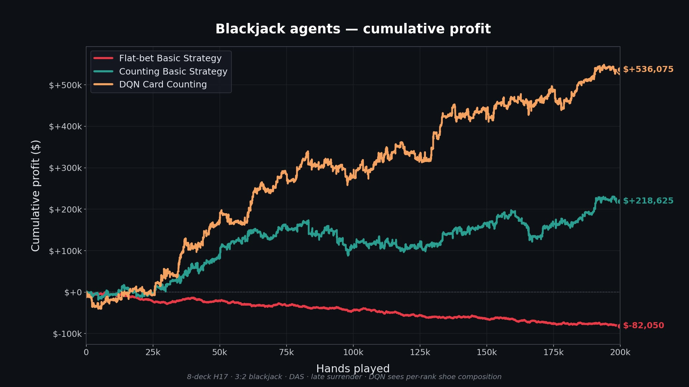

<div align="center">

# Blackjack Intelligence Lab

### Can an AI that sees every card left in the shoe outperform a professional card counter?

[](https://github.com/lukegeel101/BlackJack-Q-Learning-RL/actions/workflows/ci.yml)
[](https://www.python.org/)
[](https://pytorch.org/)
[](https://github.com/lukegeel101/BlackJack-Q-Learning-RL/stargazers)
[](https://www.linkedin.com/in/luke-geel/)

**Deep reinforcement learning, exact expectimax evaluation, policy distillation, and composition-aware betting in a realistic blackjack simulator.**

[Results](#the-headline-numbers) | [Watch the experiment](#watch-it-play) | [How it works](#how-it-works) | [Run it](#run-it-yourself) | [Accuracy report](ACCURACY_FINDINGS.md)

<a href="blackjack_results.mp4">
  
</a>

</div>

This project compares four blackjack agents under shared shoe sequences, from flat-bet basic strategy to an integrated composition-aware system.
The central question is not whether a neural network can produce an impressive profit curve, but whether it makes measurably better decisions than a strong human-card-counting baseline.

The short answer is nuanced: **the original RL agent appeared to win for the wrong reason, while exact-EV policy distillation and composition-aware betting produced smaller but measurable accuracy gains.**
The repository includes the simulator, trained checkpoints, exact solver, evaluation harnesses, CI smoke tests, and the full investigation that separated genuine policy quality from blackjack variance.

> [!IMPORTANT]
> The 200,000-hand chart above is a visualization, not the headline result.
> The conclusions below use 24 shared seeds and low-variance comparisons against computed or Monte-Carlo ground truth.

## The headline numbers

24 seeds × 100,000 hands per agent (2.4M hands each), common random numbers, 8-deck H17 shoe, $50 unit with a 1–50 bet spread. Edge is profit ÷ **actual money wagered**:

| Agent | Strategy | Edge | $/hand | Avg bet |
|---|---|---:|---:|---:|
| 1. Flat-bet Basic | Basic strategy, flat $50 | **−0.581%** | −$0.29 | $50 |
| 2. Counting Basic | Basic + Hi-Lo + Illustrious-18 + bet ramp | **+0.991%** | +$0.92 | $93 |
| 3. DQN Card Counting | Hi-Lo ramp, Dueling QR-DQN plays | **+2.062%** | +$2.32 | **$113** |
| 4. **Integrated** | Composition-aware bet + solver-distilled play | **+1.174%** | +$1.10 | $93 |

Agent 3 books the most money — but **not because it plays better**. Its decisions are provably *further* from optimal than plain basic strategy; it wins by putting more money on the table (avg bet $113 vs $93) through a shoe-flow side effect described below.

Agent 4 is risk-matched to the counter (identical bet-size distribution) and leads it by **+0.183% edge, 95% CI [−0.117, +0.482]** — positive, but **not statistically distinguishable from zero** (14 of 24 seeds positive, t ≈ 1.2).

> An earlier 8-seed run of this same comparison put Agent 4's lead at +0.360%. Tripling the seeds halved it and left it inside the noise. That is regression to the mean, and it is the same trap the original +5.36% headline fell into — so the honest statement is that Agent 4's **measured accuracy** gains (§2–4 below, all statistically significant against ground truth) are real, while their **dollar** translation is too small to demonstrate at this sample size.

Money results in blackjack are extremely noisy: per-seed edges for the same agent swing by more than a percentage point. That is why nearly every claim below is backed by a low-variance metric instead of a profit curve.

## Watch it play

<p align="center">
  <video src="https://github.com/lukegeel101/BlackJack-Q-Learning-RL/raw/main/blackjack_results.mp4" controls autoplay muted loop width="100%"></video>
</p>

<p align="center">
  <a href="blackjack_results.mp4"></a>
</p>

The video is one 200,000-hand run on a shared seed, and it reproduces exactly:

| Agent | Edge | Net @ $50 unit | Avg bet |
|---|---:|---:|---:|
| 1. Flat-bet Basic | −0.821% | −$82,050 | $50.00 |
| 2. Counting Basic | +1.175% | +$218,625 | $93.05 |
| 3. DQN Card Counting | +2.354% | +$536,075 | $113.85 |

> **Correction.** Earlier versions of this README reported +2.19% and +5.36% for Agents 2 and 3. The *net profits* were right, but those edge figures divided profit by flat-bet volume (hands × $50) instead of by the money actually wagered — which inflates any ramping agent by its bet multiplier (≈1.9× and ≈2.3× here). The corrected edges are above. `simulate.py` computes this correctly today.

**One seed is not evidence.** This run is a favorable sample for Agent 3; across 24 seeds its advantage over the counter is both smaller and, as shown below, not attributable to better play. Treat the video as an illustration of the setup, not as a result.

---

## Why four agents?

1. **Agent 1** establishes the baseline house edge — basic strategy, no counting.
2. **Agent 2** adds Hi-Lo counting and bet ramping. This is what a real human counter does, and it is the bar to beat.
3. **Agent 3** keeps Agent 2's bet ramp but hands *play* decisions to a Dueling QR-DQN that sees the full remaining-shoe composition. Isolates the play policy.
4. **Agent 4** replaces *both* levers with composition-aware models: bets sized from a learned EV estimate, plays taken from a solver-distilled network.

---

## How it works

### The environment (`cardCounting.py`)

- 8-deck shoe, ~84% penetration (reshuffle after 350 cards)
- Dealer hits soft 17, blackjack pays 3:2, DAS, late surrender
- US peek on T/A upcards; split aces get one card each; up to 4 hands
- Hi-Lo running count maintained as cards are dealt

Fixing edge-case bugs here was about half the original work — an `is_soft` reset bug, an `is_blackjack` flag that didn't unset after `add_card`, split-hand bankroll double-counting, and bet ramping that used the post-deal count instead of pre-deal.

### The agents (`agents.py`)

**Agent 1 — `FlatBetBasicStrategyAgent`** — multi-deck H17 basic-strategy tables, flat bet.

**Agent 2 — `CountingBasicStrategyAgent`** — the same tables plus Illustrious-18, Fab-4 surrender indices, Sweet-16/Catch-22 additions, and soft/pair deviations. Bet ramp is a 1–50 unit spread keyed off the **pre-deal** true count.

**Agent 3 — `DQNCardCountingAgent`** — Agent 2's bet ramp; play decisions from a `DuelingQRDQN` over a 34-dim feature vector (8 game-state dims + 13 per-rank shoe fractions + 13 per-rank next-card probabilities). Hybrid: basic+I18 by default, the net overrides only when its argmax beats the default by ≥0.05 EV-units (~10% of hands).

**Agent 4 — `IntegratedCardCountingAgent`** — combines the two models this project's later work produced:
- **Bet:** `BetValueNet` predicts the upcoming round's EV from the pre-deal composition. Its output is mapped through a **quantile ramp** that copies the Hi-Lo bet-size distribution *exactly* — same min, max, mean ($94.85 vs $94.85 over 300k calibration hands) and same total wagered — so only the *allocation* of bets differs. Risk-matched by construction.
- **Play:** basic+I18, overridden by the solver-distilled net on the ~2.5% of hands where it is confidently better.

### Architectures

`DuelingQRDQN` (RL) predicts 8 quantiles of the return distribution per action — fixing scalar-Q's variance-aversion on doubles — with a dueling V/A split, n-step returns (n=3) and Polyak target updates. `DuelingQNet` (distillation) is a scalar dueling net regressed onto exact solver EVs. `BetValueNet` is a small MLP mapping 15 composition features to an expected round EV.

---

## What the numbers actually say

This is the part worth reading.

### 1. Money is the wrong yardstick

A single hand's result has standard deviation ~1.1, while the EV differences that separate these policies are ~0.002–0.02. Even at 1.5M hands, two betting signals cannot be told apart from realized profit. So everything below uses a low-variance metric instead:

- **Play quality** → exact per-action EVs from the expectimax solver (`optimal_policy.py`). Metric: *EV-loss* = EV(optimal action) − EV(chosen action). Always ≥ 0; 0 is perfect play.
- **Bet quality** → the Monte-Carlo *true* EV of a shoe, by replaying each exact composition ~10,000 times (`mc_true_ev.py`). Metric: betting correlation — the same quantity behind the classic "Hi-Lo is ~0.97 efficient" figure.

### 2. The RL DQN's play is worse than basic strategy

Scored against the solver on held-out states (two independent sets):

| Policy | EV-loss/hand | Agrees with optimal |
|---|---:|---:|
| basic+I18 (Agent 2's play) | 0.00159 / 0.00161 | ~95.0% |
| **solver-distilled hybrid** @0.05 | **0.00111 / 0.00099** | ~95.8% |
| RL DQN hybrid @0.05 (Agent 3) | 0.01060 / 0.01077 | ~87% |

Agent 3's overrides are net-negative. On the 12% of hands where it overrides basic strategy, basic was already optimal **81%** of the time, and the DQN's replacement action was optimal only **16%** of the time. Raising its override threshold monotonically *improves* it, and at a threshold high enough that it never overrides, it exactly equals basic+I18 — confirming that every override, on net, costs EV.

Training it longer does not fix this: continuing the 1M-episode checkpoint for another 164k episodes made it worse on every held-out seed (paired −1.34%).

### 3. Supervised distillation on exact EVs does beat basic strategy

Training a net on 20k solver-labeled states (`gen_optimal_dataset.py` → `train_supervised.py`) produces a policy that overrides basic strategy on only **2.5%** of hands — and on those hands basic was optimal just 49% of the time, while the net is optimal **73%** of the time. Its regret there is 0.0122 versus basic's 0.0314. That is the composition-aware play edge this project was originally reaching for, and it generalizes across held-out sets.

(Two bugs surfaced here: `gen_optimal_dataset.py` hardcoded 28 features against a 34-dim spec, and `train_supervised.py`'s defaults early-stopped before the net broke symmetry, collapsing it to an always-STAND policy.)

### 4. Composition-aware betting beats Hi-Lo — once trained properly

Scored against 1,500 Monte-Carlo-labeled shoes:

| Betting signal | Corr. vs true EV | EV-RMSE | Edge |
|---|---:|---:|---:|
| Hi-Lo true count | 0.700 | 0.0129 | 0.501% |
| composition net, under-trained (700k hands, 64-wide) | 0.668 | 0.0140 | 0.426% |
| **composition net, 5M hands, 256-wide** | **0.750** | **0.0120** | **0.568%** |

The first version of this net was *worse* than Hi-Lo. Trained extensively it is significantly better: paired-bootstrap correlation difference **+0.045, 95% CI [+0.029, +0.061]**. Correcting for the benchmark's own MC noise (which caps observable correlation at ~0.78), the net correlates ≈0.96 with true EV versus Hi-Lo's ≈0.90.

A genuine but small win: Hi-Lo is already a very efficient summary of the shoe, which is exactly why it became the standard. Extra capacity, more epochs, and 3-net ensembling all plateau around 0.752 — the 15 composition features fully specify the shoe, so there is no further signal to extract.

### 5. So where does Agent 3's money edge come from?

Two hypotheses, both tested:

- **Metric bias from doubles and splits?** No. Recomputing edge against true wagered money (including doubled and split bets) gives 1.142× inflation for Agent 3 versus 1.131× for the counter — essentially identical.
- **Shoe flow.** Yes. Over 60k hands:

| Agent | Avg pre-deal TC | % hands at TC≥2 | Cards/hand | Hands/shoe |
|---|---:|---:|---:|---:|
| Hi-Lo counter | −0.220 | 13.1% | 5.34 | 65.0 |
| RL DQN | **+0.148** | **16.3%** | 5.35 | 64.9 |
| Integrated | −0.233 | 12.7% | 5.34 | 65.0 |

Same cards per hand and hands per shoe, but Agent 3's deviations change *which count regimes its hands land in*: it plays 24% more of its hands at TC ≥ 2, so the same bet ramp puts more money out when the shoe is genuinely rich. (Hand-weighted average true count is negative for everyone, because low-count stretches consume more cards per hand and therefore generate more hands.) This is a real effect in a heads-up simulation, but it is a side effect of playing *differently* — not of deciding *better* — and it is not something a player controls at a real table where other players consume cards too.

All three findings are consistent: Agent 3 plays **worse** per hand, bets **bigger** more often by accident, and books more money at higher variance. Agent 4 plays **better** per hand at **matched** risk.

---

## Run it yourself

```bash
pip install -r requirements.txt
```

```bash
# 4-way comparison on common random numbers (the headline table)
python compare_integrated.py --hands 100000 --seeds $(seq 1 24)

# Original 3-way harness, single seed
python simulate.py --hands 200000 --seed 42
```

Reproducing the models:

```bash
# Agent 3's RL net (~14 min on an M2)
python train_dqn.py --episodes 1000000 --epsilon-decay-episodes 800000

# Solver-distilled play net: label states, then distill
python gen_optimal_dataset.py --num-states 20000 --out optimal_dataset_34d.npz
python train_supervised.py --dataset optimal_dataset_34d.npz --save-path dqn_agent_distilled.pt

# Composition betting net: collect rounds, train, calibrate the ramp
python gen_bet_dataset.py --hands 5000000 --seed 1 --out bet_train.npz
python gen_bet_dataset.py --hands 2000000 --seed 999 --out bet_eval.npz
python train_bet_value.py --train bet_train.npz --eval bet_eval.npz --hidden 256
python calibrate_bet_ramp.py --model bet_value_net.pt --hands 300000

# Ground-truth benchmark + scoring
python mc_true_ev.py --num-comps 1500 --reps 10000 --out mc_ev.npz
python score_bet.py --mc mc_ev.npz --models bet_value_net.pt
```

Rendering the video:

```bash
python make_video.py --hands 200000 --seed 42 --out blackjack.mp4 \
    --frames 600 --hold-frames 120 --fps 30
```

---

## Repository layout

| File | What it is |
|---|---|
| `cardCounting.py` | Blackjack environment — deck, hand, dealer, Hi-Lo counter |
| `agents.py` | All four agents + strategy tables + network architectures |
| `simulate.py` | Single-seed 3-way comparison harness |
| `compare_integrated.py` | 4-way comparison on common random numbers |
| `make_video.py` | Renders the animated cumulative-profit MP4 |
| `ACCURACY_FINDINGS.md` | Full writeup of the measurement work |

**Play models**

| File | What it is |
|---|---|
| `train_dqn.py` | QR-DQN trainer (warm-start + n-step RL; resumable in chunks) |
| `optimal_policy.py` | Exact expectimax solver — true optimal action and per-action EVs |
| `gen_optimal_dataset.py` | Parallel solver-labeled dataset builder |
| `train_supervised.py` | Distills a net onto exact solver EVs |
| `dqn_agent.pt` | Agent 3's 1M-episode QR-DQN |
| `dqn_agent_distilled.pt` | Solver-distilled play net (more accurate) |
| `optimal_dataset_34d.npz` | 20k exact-EV labeled states |

**Betting models**

| File | What it is |
|---|---|
| `gen_bet_dataset.py` | Records pre-deal composition, true count, realized outcome |
| `train_bet_value.py` | Trains `BetValueNet` and compares it to Hi-Lo |
| `calibrate_bet_ramp.py` | Fits the quantile bet ramp (risk-matches to Hi-Lo) |
| `mc_true_ev.py` | Monte-Carlo ground-truth EV benchmark |
| `score_bet.py` | Scores betting signals against that benchmark |
| `bet_value_net.pt` | Trained composition betting model |

---

## What I learned

- **Env bugs mattered more than algorithm choices.** Early DQN runs lost money, and the cause was almost always a subtle environment bug rather than the learning algorithm.
- **Bet on the pre-deal true count, not the post-deal one.** The post-deal count is anti-correlated with the hand's outcome. This erased most of Agent 2's edge until it was caught.
- **Variance-aversion is real and fixable.** Scalar-Q DQN learned to almost never double on 11 vs 10; QR-DQN's quantile heads see the full return distribution and take the high-mean action anyway.
- **Check the denominator.** The original headline edges divided profit by flat-bet volume instead of money wagered, roughly doubling them. The net profits were right the whole time; the ratio was not.
- **A profit curve is not evidence.** The most important lesson here. Agent 3 beat the counter on the seed I filmed, and I believed it. It took an exact-EV oracle to show the play policy was actually *worse*, and a Monte-Carlo EV benchmark to show where the money was really coming from. If you can build a low-variance metric, build it before you believe your results.
- **RL was the wrong tool for this part.** Learning action values from one noisy money outcome per hand cannot pin down rare composition-dependent states. Supervised distillation on exact solver EVs gets there in minutes and is ~10× more accurate.
- **Hi-Lo is really good.** A composition-aware net *can* beat it, but only after serious training, and only by a few percent of betting correlation. The count survived decades of scrutiny for a reason.

---

## Game rules summary

```
Tables           : High-limit, 8 decks, dealer hits soft 17
Payouts          : Blackjack 3:2, double 1:1 on doubled stake, surrender forfeits 0.5
Doubling         : On any first 2 cards, including after splits
Splitting        : Up to 4 hands; aces get exactly 1 card each (no hit/double/resplit)
Surrender        : Late surrender, only the first action of an un-split hand
Peek             : US peek — dealer checks for BJ on T/A upcards before player acts
Penetration      : ~84% (reshuffle after 350 of 416 cards dealt)
Min/max bet      : $50 / $2,500 (1–50 unit spread)
```
